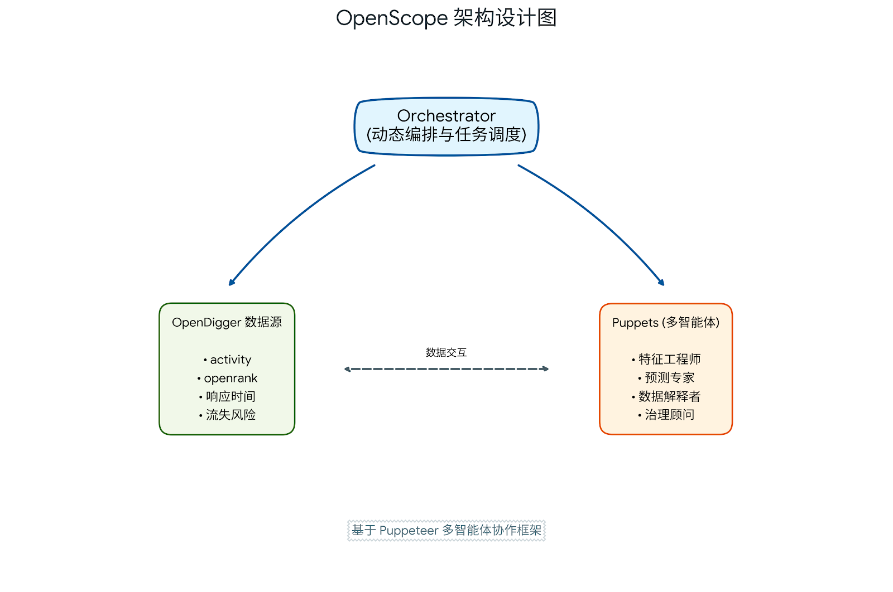
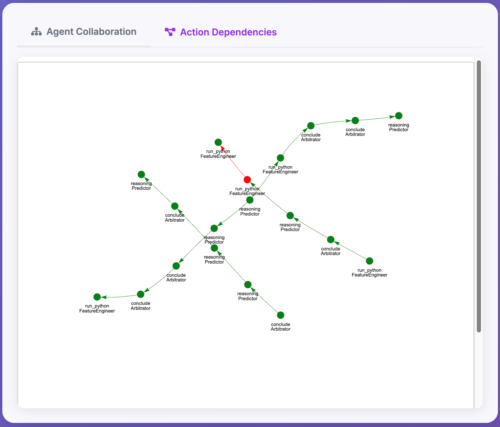
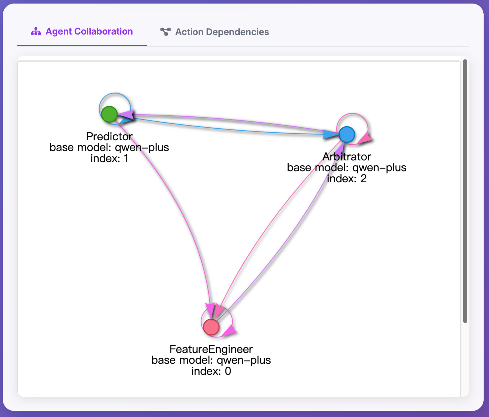

# OpenScope 🔭

<div align="center">

**基于多智能体协作的开源社区数据多视角解读框架**

[](https://www.python.org/downloads/)
[](LICENSE)
[](https://github.com/X-lab2017/open-digger)

[English](README_EN.md) | 简体中文

</div>

---

## 📖 简介

**OpenScope** 是一个创新的开源社区数据分析框架，基于 [Puppeteer](https://github.com/OpenBMB/ChatDev) 多智能体协作系统，集成 [OpenDigger](https://github.com/X-lab2017/open-digger) 数据源，通过多个专业视角的智能体协同工作，对开源社区的健康度、活跃度、贡献者行为等关键指标进行深度分析和预测。

### 🌟 核心特性

- **🤖 多智能体协作**：基于 Puppeteer 框架的动态编排机制，多个专业智能体（特征工程师、预测专家、解释者、治理顾问等）协同工作
- **📊 丰富的数据源**：集成 OpenDigger 提供的开源社区多维度指标数据（OpenRank、活跃度、响应时间、贡献者流失等）
- **🔮 智能预测**：运用时间序列分析和机器学习方法预测社区未来发展趋势
- **💡 多视角解读**：从技术、管理、社区治理等多个角度解读数据，提供可执行的建议
- **🎯 自适应编排**：通过强化学习训练的 Orchestrator 动态调度智能体，适应不同复杂度的分析任务

### 🏗️ 架构设计

<div align="center">
  
</div>

### 🖥️ 运行界面展示

<div align="center">
  <h3>1. 智能分析大屏</h3>
  
  <p><i>实时展现社区分析结论、关键洞察及治理建议</i></p>
  <br>

  <h3>2. 智能体协作图谱</h3>
  
  <p><i>动态生成的多智能体推理与执行路径</i></p>
  <br>

  <h3>3. 行动依赖关系</h3>
  
  <p><i>各角色智能体之间的交互与依赖结构</i></p>
</div>

---

## 🚀 快速开始

### 前置要求

- **Python 3.11** 或更高版本
- **CUDA GPU**（可选，用于策略训练）
- **API Keys**：OpenAI API（或其他 LLM 服务）

### 安装步骤

#### 1. 克隆仓库

```bash
git clone https://github.com/yourusername/OpenScope.git
cd OpenScope
```

#### 2. 创建 Python 环境

```bash
# 使用 conda 创建虚拟环境（推荐）
conda create -n openscope python=3.11
conda activate openscope

# 或使用 venv
python -m venv openscope_env
source openscope_env/bin/activate  # Linux/Mac
# openscope_env\Scripts\activate  # Windows
```

#### 3. 安装依赖

```bash
# 进入项目目录
cd ChatDev

# 安装所有依赖
pip install -r requirements.txt
```

#### 4. 下载 Puppeteer 模型基座

OpenScope 策略网络模型保存在在/checkpoint/policy_net_20260105_091009.pt中，同时使用 70B 奖励模型作为 Puppeteer 的奖励模型，通过 api 调用 Qwen2.5-plus 模型作为智能体基座。你可以：

**方法 1：直接从 Hugging Face 加载**
```yaml
# 在配置文件中设置（推荐）
model_weight_path: nvidia/Llama-3.1-Nemotron-70B-Reward
# 或者使用 Skywork 8B 模型
# model_weight_path: Skywork/Skywork-Reward-Llama-3.1-8B
```

**方法 2：手动下载模型权重**
```bash
# 使用 git-lfs 下载
git lfs install
git clone https://huggingface.co/nvidia/Llama-3.1-Nemotron-70B-Reward
# 或者下载 Skywork 8B
git clone https://huggingface.co/Skywork/Skywork-Reward-Llama-3.1-8B
```

#### 5. 配置系统

编辑配置文件 `ChatDev/puppeteer/config/global.yaml`：

```yaml
# API 配置
logging:
  level: INFO                      # 日志级别：DEBUG, INFO, WARNING, ERROR
  logpath: ./logs                  # 日志文件存储路径

# Puppeteer 模型权重路径
model_weight_path: nvidia/Llama-3.1-Nemotron-70B-Reward
# model_weight_path: Skywork/Skywork-Reward-Llama-3.1-8B

api_keys:
  openai_api_key: "sk-your-key-here"           # 你的 OpenAI API Key
  openai_base_url: "https://api.openai.com/v1/" # OpenAI API 地址
  bing_api_key: ""                              # Bing 搜索 API（可选）

# 系统重试配置
max_retry_times: 10                # API 调用最大重试次数
max_json_reformat_turns: 10        # JSON 解析重试次数

# 外部工具开关
external_tools_enabled: True       # 启用外部工具（搜索、文件读取等）

# 文件路径
file_path:
  root_file_path: ./data           # 智能体访问的根文件路径

# 图探索参数（多智能体推理）
graph:
  max_parallel_paths: 4            # 最大并行路径数（建议 2-6）
  max_step_num: 5                  # 每条路径最大步数（建议 4-6）
```

⚠️ **重要**：请替换所有占位符为你的实际 API Key 和 URL。

---

## 📊 使用指南

### OpenDigger 数据分析任务

OpenScope 专为开源社区数据分析设计，提供两种任务模式：

#### 模式 1：OpenDigger 自由分析

运行开放式的社区数据分析，智能体会自主进行特征工程、预测、解释和建议。

```bash
# 从项目根目录开始
cd ChatDev/puppeteer
python main.py OpenDigger validation --data_limit 10
```

**参数说明**：
- `OpenDigger`：任务类型，使用 OpenDigger 数据
- `validation`：数据模式（validation/test/train）
- `--data_limit 10`：限制处理的数据量（用于快速测试）

#### 模式 2：OpenDigger + MMLU 风格问答

结合 MMLU 风格的多选题格式，评估智能体对社区趋势的预测能力。

# 从项目根目录开始
cd ChatDev/bash
cd puppeteer
python main.py OpenDiggerMMLU validation --data_limit 5
```

### 支持的其他任务

OpenScope 基于 Puppeteer 框架，也支持其他基准测试任务：

``确保在 ChatDev/puppeteer 目录下
cd ChatDev/puppeteer

# `bash
# MMLU-Pro 学术推理任务
python main.py MMLU-Pro validation --data_limit 10

# GSM-Hard 数学推理任务
python main.py gsm-hard validation --data_limit 10

# SRDD 社交推理任务
python main.py SRDD validation --data_limit 10

# 创意写作任务
python main.py CW validation --data_limit 10
```

### 自定义智能体

智能体配置文件位于 `puppeteer/personas/personas.jsonl`，你可以：

1. **添加新的智能体角色**：
```jsonl
{
  "name": "CommunityHealthAnalyst",
  "role": "专注于开源社区健康度分析的专家",
  "tools": ["run_python", "web_search"],
  "backbone": "gpt-4o"
}
```

2. **修改现有智能体**：
   - 调整角色描述（`role`）
   - 配置工具权限（`tools`）
   - 更换模型后端（`backbone`）

### 数据准备

# 从项目根目录进入 opendigger 目录
cd ChatDevOpenDigger 数据获取

```bash
cd ../opendigger

# 批量获取多个仓库的数据
python batch_get_data.py

# 生成问答对数据集（用于 MMLU 模式）
python generate_dataset.py
```

支持的数据指标：
- **openrank**：仓库/贡献者的影响力评分
- **activity**：仓库活跃度
- **issue_response_time**：Issue 平均响应时间
- **change_request_response_time**：PR 平均响应时间
- **inactive_contributors**：不活跃贡献者数量

数据将存储在 `opendigger/data_warehouse/` 目录。

### 🌐 Web 可视化界面

OpenScope 提供了两套 Web UI 用于可视化多智能体推理过程：

#### 方式 1：Flask 单页应用（推荐快速演示）

使用 Flask 后端 + SSE（Server-Sent Events）实时流式传输日志。

**启动服务**：

```bash
cd ChatDev/puppeteer/web_ui
python app.py
```

服务将在 `http://localhost:5000` 启动。

**使用步骤**：
1. 在浏览器中打开 `http://localhost:5000`
2. 在输入框中输入要分析的仓库名称（如 `golang/go`）
3. 点击 "Start Inference" 按钮
4. 实时查看智能体推理过程和日志输出
5. 等待分析完成，查看预测结果

**功能特性**：
- 📊 实时日志流式输出
- 🔄 自动获取 OpenDigger 数据（如果可用）
- 📈 展示推理路径和智能体协作序列
- 💡 提供可视化的分析结果

#### 方式 2：FastAPI + React 前后端分离（适合生产环境）

使用 FastAPI 后端 + React 前端 + WebSocket 实现双向通信。

**启动后端**：

```bash
cd ChatDev/puppeteer/web_ui/backend
pip install fastapi uvicorn websockets  # 如未安装
uvicorn main:app --host 0.0.0.0 --port 8000 --reload
```

**启动前端**（需要 Node.js）：

```bash
cd ChatDev/puppeteer/web_ui/frontend
npm install  # 首次运行需要安装依赖
npm start
```

前端将在 `http://localhost:3000` 启动，自动连接后端 `http://localhost:8000`。

**功能特性**：
- ⚡ WebSocket 双向实时通信
- 🎨 现代化 React UI（Tailwind CSS + Framer Motion）
- 🔍 更丰富的可视化效果
- 🔌 RESTful API 支持扩展

**依赖安装**：

```bash
# Flask 版本
pip install flask

# FastAPI 版本
pip install fastapi uvicorn websockets
```

**常见问题排查**：

**Q: 前端刷新后页面空白或没有内容？**
- **原因**：WebSocket 连接失败，后端服务未运行
- **解决方案**：
  1. 确保后端服务正在运行：`uvicorn main:app --host 0.0.0.0 --port 8000`
  2. 检查浏览器控制台（F12）是否有 WebSocket 连接错误
  3. 查看页面左上角的连接状态指示器（绿色=已连接，红色=未连接）
  4. 如果显示连接错误横幅，按照提示启动后端服务

**Q: Flask 版本端口已被占用？**
- 修改 `app.py` 最后一行的端口号：`app.run(host='0.0.0.0', port=5001)`

**Q: React 前端无法连接到后端？**
- 确认后端地址，如果后端不在 localhost，需要修改 `App.js` 中的 WebSocket URL
- 检查防火墙是否阻止了 8000 端口

---

## 📁 项目结构

```
OpenScope/
├── ChatDev/
│   ├── README.md              # 本文件
│   ├── requirements.txt       # Python 依赖
│   │
│   ├── opendigger/           # OpenDigger 数据获取模块
│   │   ├── getdata.py        # 核心数据获取类
│   │   ├── batch_get_data.py # 批量数据获取脚本
│   │   ├── generate_dataset.py # 数据集生成（MMLU 格式）
│   │   └── data_warehouse/   # 原始数据存储
│   │
│   └── puppeteer/            # Puppeteer 多智能体框架
│       ├── main.py           # 主入口
│       ├── manual_inference.py # 手动推理模式
│       │
│       ├── config/           # 配置文件
│       │   ├── global.yaml   # 全局配置（API、路径等）
│       │   └── policy.json   # 策略配置
│       │
│       ├── personas/         # 智能体角色定义
│       │   └── personas.jsonl
│       │
│       ├── tasks/            # 任务定义
│       │   ├── opendigger_task.py      # OpenDigger 自由分析任务
│       │   ├── opendigger_mmlu.py      # OpenDigger MMLU 任务
│       │   ├── mmlu_pro.py
│       │   ├── gsm_hard.py
│       │   └── ...
│       │
│       ├── agent/            # 智能体实现
│       ├── model/            # Puppeteer 模型
│       ├── tools/            # 工具集（Python 执行器、搜索等）
│       ├── inference/        # 推理引擎
│       ├── checkpoint/       # 模型检查点
│       ├── logs/             # 运行日志
│       ├── results/          # 结果输出
│       ├── data/             # 数据文件
│       │
│       └── web_ui/           # Web 可视化界面
│           ├── app.py        # Flask 单页应用入口
│           ├── templates/    # Flask HTML 模板
│           │   └── index.html
│           ├── backend/      # FastAPI 后端
│           │   └── main.py   # FastAPI 服务入口
│           └── frontend/     # React 前端
│               ├── package.json
│               ├── src/      # React 组件源码
│               └── public/   # 静态资源
│
└── assets/                   # 资源文件（图片、文档等）
```

---

## 🔧 高级配置

### 策略配置

Orchestrator 的策略行为可以通过 `ChatDev/puppeteer/config/policy.json` 进行配置：

```json
{
  "dataset_name": "OpenDigger",
  "dataset_mode": "validation",
  "paths": {
    "checkpoint_path": "checkpoint/OpenDigger_validation"
  }
}
```

策略实现位于 `puppeteer/inference/policy/` 目录，当前使用 REINFORCE 强化学习算法。

> **注意**：如需训练自定义策略，请参考 `inference/policy/REINFORCE_continuous.py` 中的实现。策略训练需要 GPU 支持。

### 并行路径与步数调整

在 `config/global.yaml` 中调整图探索参数：

```yaml
graph:
  max_parallel_paths: 6    # 增加并行度以探索更多策略
  max_step_num: 8          # 增加步数以处理更复杂任务
```

**注意**：增加这些参数会提高计算成本和 API 调用次数。

### 日志与调试

启用详细日志：

```yaml
logging:
  level: DEBUG              # 输出详细的调试信息
  logpath: ./logs
```

查看日志：
```bash
tail -f logs/latest.log
```

---

## 🧪 示例输出

运行 OpenDigger 任务后，你将在 `puppeteer/results/OpenDigger_validation/` 看到：

```
results/
└── OpenDigger_validation/
    ├── X-lab2017_open-digger_context.csv    # 原始数据
    ├── analysis_report.json                  # 分析报告
    └── predictions.json                      # 预测结果
```

**示例分析报告**：
```json
{
  "repository": "X-lab2017/open-digger",
  "analysis_period": "2023-01 to 2023-06",
  "predictions": {
    "next_month_openrank": 15.32,
    "next_month_activity": 142.5,
    "trend": "increasing"
  },
  "insights": [
    "活跃度在过去 3 个月持续上升 (+23%)",
    "Issue 响应时间从 48h 降至 24h，社区反应更迅速",
    "贡献者流失风险较低（inactive_contributors 稳定）"
  ],
  "recommendations": [
    "继续保持快速响应策略",
    "关注新贡献者的引导和留存",
    "考虑扩展社区治理团队"
  ]
}
```

---

## 🤝 贡献指南

我们欢迎各种形式的贡献！

### 如何贡献

1. **Fork 本仓库**
2. **创建特性分支** (`git checkout -b feature/AmazingFeature`)
3. **提交更改** (`git commit -m 'Add some AmazingFeature'`)
4. **推送到分支** (`git push origin feature/AmazingFeature`)
5. **提交 Pull Request**

### 贡献方向

- 🌐 添加更多数据源支持
- 🤖 设计新的智能体角色
- 📊 改进预测算法
- 🐛 修复 Bug
- 📖 完善文档

---

## 📄 开源协议

本项目基于 **Apache License 2.0** 开源协议。详见 [LICENSE](LICENSE) 文件。

---

## 🙏 致谢

OpenScope 的开发基于以下优秀的开源项目：

- [**Puppeteer**](https://github.com/OpenBMB/ChatDev) - 动态多智能体协作框架
- [**OpenDigger**](https://github.com/X-lab2017/open-digger) - 开源社区数据平台
- [**LangChain**](https://github.com/langchain-ai/langchain) - LLM 应用开发框架

感谢所有贡献者和开源社区的支持！

---

## 📬 联系我们

- **Issues**：[提交 Issue](https://github.com/yourusername/OpenScope/issues)
- **讨论**：[GitHub Discussions](https://github.com/yourusername/OpenScope/discussions)

---

## 🗺️ 路线图

- [ ] 支持更多开源数据源（GitHub Insights, GitLab Analytics）
- [x] ~~添加可视化 Dashboard~~ （已完成，提供 Flask 和 React 两种方案）
- [ ] 实现实时数据流分析
- [ ] 支持更多 LLM 后端（Claude, Gemini, 本地模型）
- [x] ~~开发 Web UI 界面~~ （已完成）
- [ ] 提供预训练的策略模型下载
- [ ] 增强 Web UI 的图可视化功能
- [ ] 支持多仓库对比分析

---

<div align="center">

**如果 OpenScope 对你有帮助，请给我们一个 ⭐️ Star！**

Made with ❤️ by OpenScope Team

</div>
